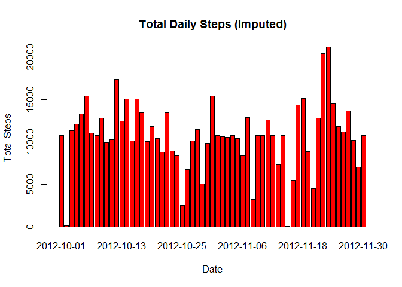

# Reproducible Research: Peer Assessment 1
*Author: Chirag Gandhi*

Loading and preprocessing the data

```r
        workingDirectory <- c("C:\\Users\\Chirag\\chirag personal\\US\\coursera\\RepData\\RepData_PeerAssessment1")
       
        filename <- c("activity.csv")
        setwd(workingDirectory)
        
        stepData <- read.csv(file = filename, na.strings="NA")
        stepData$interval <- factor(stepData$interval)
```
## What is mean total number of steps taken per day?


```r
        tot_steps <- aggregate(steps ~ date, stepData, FUN=sum)
        
        barplot(tot_steps$steps, names=tot_steps$date, col="blue", main="Total Daily Steps",xlab="Date", ylab="Total Steps")
```

 

```r
        mean_steps <- format(mean(tot_steps$steps, na.rm=TRUE), digits=2, nsmall=2)
        
        median_steps <- format(median(tot_steps$steps, na.rm=TRUE), digits=2, nsmall=2)
```
The Average number of steps taken daily (Mean) = **10766.19  **  

The Median number of steps taken daily (Median) = **10765**

## What is the average daily activity pattern?

```r
        dailyAvg <- aggregate(steps ~ interval, stepData, FUN = mean)
        plot(dailyAvg$interval, dailyAvg$steps, type="n", main="Average Daily Activity Pattern",xlab="Interval", ylab="Average Steps")
        lines(dailyAvg$interval, dailyAvg$steps, type="l")
```

 

```r
        # dailyAvg$interval[which.max(dailyAvg$steps)]
```

The Interval containing the maximum average daily steps is **835**  

**Imputing missing values**


```r
        # sum(is.na(stepData$steps))
```

Number of records missing step counts is **2304**

To fill the missing values we are going to take the average for that time interval and replace the NA with the average value


```r
        imputedStepData <- stepData
        
        imputedStepData$steps[which(is.na(imputedStepData$steps))] <- dailyAvg$steps[imputedStepData$interval[which(is.na(imputedStepData$steps))]]
```
Total number of steps per day

```r
        tot_stepsImp <- aggregate(steps ~ date, imputedStepData, FUN=sum)
        
        barplot(tot_stepsImp$steps, names=tot_stepsImp$date, col="red", main="Total Daily Steps (Imputed)",xlab="Date", ylab="Total Steps")
```

 

```r
        mean_stepsImp <- format(mean(tot_stepsImp$steps, na.rm=TRUE), digits=2, nsmall=2)
        
        median_stepsImp <- format(median(tot_stepsImp$steps, na.rm=TRUE), digits=2, nsmall=2)
```
The Average number of steps taken daily for Imputed dataset(Mean) = **10766.19  **  

The Median number of steps taken daily for Imputed dataset(Median) = **10766.19**


```r
        # mean_diff <- as.numeric(mean_steps) - as.numeric(mean_stepsImp)
        # median_diff <- as.numeric(median_steps) - as.numeric(median_stepsImp)
```

There is **0** difference to the Mean after we add the missing values  
There is **-1.19** difference to the Median after we add the missing values  

## Are there differences in activity patterns between weekdays and weekends?

Let us compute the weekdays data


```r
        imputedStepData$weekdays <- factor(weekdays(as.Date(imputedStepData$date)))
        
        imputedStepData <- within(imputedStepData, levels(weekdays)[levels(weekdays) == "Monday"] <- "Weekdays")
        imputedStepData <- within(imputedStepData, levels(weekdays)[levels(weekdays) == "Tuesday"] <- "Weekdays")
        imputedStepData <- within(imputedStepData, levels(weekdays)[levels(weekdays) == "Wednesday"] <- "Weekdays")
        imputedStepData <- within(imputedStepData, levels(weekdays)[levels(weekdays) == "Thursday"] <- "Weekdays")
        imputedStepData <- within(imputedStepData, levels(weekdays)[levels(weekdays) == "Friday"] <- "Weekdays")
        imputedStepData <- within(imputedStepData, levels(weekdays)[levels(weekdays) == "Saturday"] <- "Weekends")
        imputedStepData <- within(imputedStepData, levels(weekdays)[levels(weekdays) == "Sunday"] <- "Weekends")
```
Now to make the chart

```r
        dailyAvgImputed <- aggregate(steps ~ interval + weekdays, imputedStepData, FUN = mean)
        
        library(lattice)
        
        x.tick.number <- 5
        at <- seq(0, 288, length.out=x.tick.number)
        labels <- round(seq (0, 2355, length.out=length(at)))
        
        
        xyplot(steps~interval|weekdays, data=dailyAvgImputed, main="Average for Intervals Weekdays v/s Weekends (Imputed)", layout=c(1,2), type="l",  scales=list(x=list(at=at, labels=labels)))
```

 
